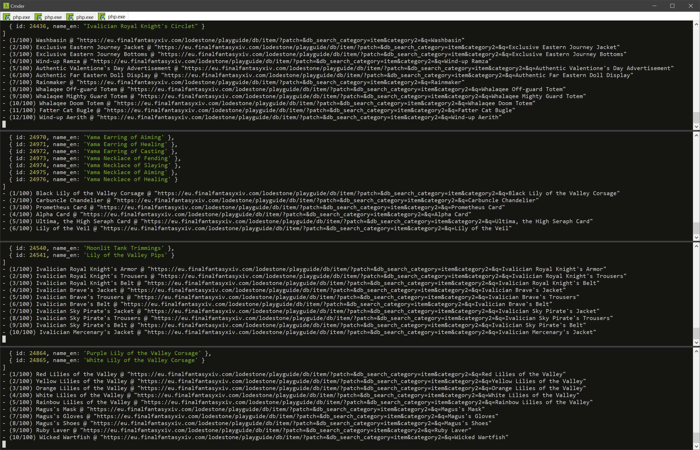

# lodestone-icons

Downloads icons from Lodestone by searching items to get those sweet HQ stuffs

## Requirements

- PHP, this is used to just bypass cors restrictions
- NodeJS v12+

## Getting started

- `git clone https://github.com/xivapi/lodestone-icons.git`
- `npm install`

This should setup everything. 

## Using

- `node app.js <start_index> <size>`
- eg: `node app.js 0 100`

> `start_index` - This is the index in the ItemData.json so 0 is the first, 30 would be the 31st entry (array index)

> `size` - this is how many from the index, so a start of 0 and size of 5 would be: 0,1,2,3,4 entries in the ItemData.json downloaded

You can just do something like: `node app.js 0 1000` and it would do all of them, however you could batch this up running multiple command line windows and each one do a segment, eg:

- Window 1: `node app.js 0 100`
- Window 2: `node app.js 100 100`
- Window 3: `node app.js 200 100`

and so on, making it so you download 3x.. 4x.. 5x as fast.

At some point SE web pages will stop loading so if you try like 20 windows it might not work... Experiment :)

